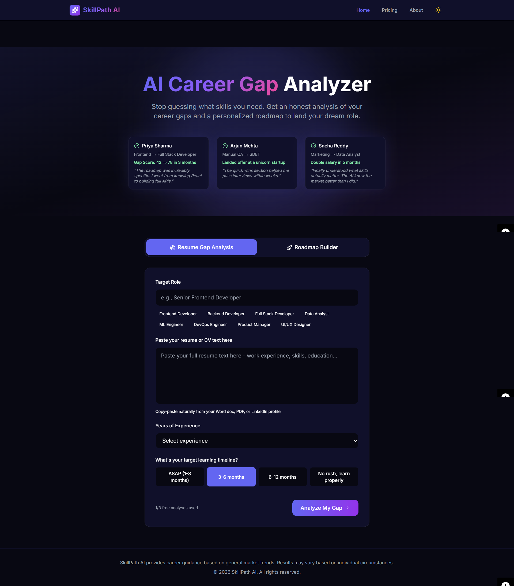
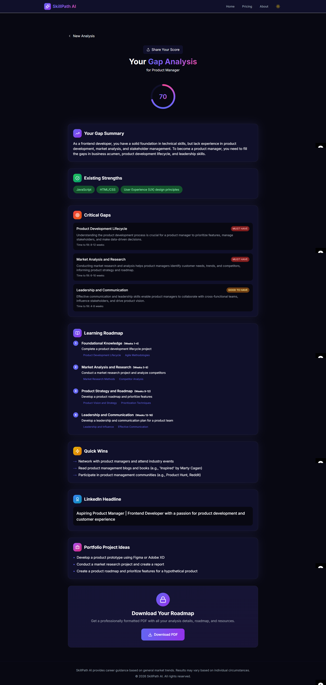

<div align="center">

# 📄 SkillPath AI

**A full-stack AI platform that analyzes career gaps and generates personalized skill roadmaps.**

Built to demonstrate dynamic, AI-driven career planning as a working product — not just a concept.

[](https://skillpath-ai-brown.vercel.app/)
[](https://nextjs.org/)
[](https://www.typescriptlang.org/)
[](https://tailwindcss.com/)
[](https://groq.com/)
[](https://skillpath-ai-brown.vercel.app/)

</div>

---

## ⚡ Try It Right Now

No setup. No sign-up. Just input your current skills and target role, and get your personalized roadmap.

| | |
|---|---|
| 🌐 **Live URL** | https://skillpath-ai-brown.vercel.app/ |

---

## 🧠 The Problem It Solves

Figuring out exactly what skills you need to transition to a new role or level up in your career can be overwhelming and confusing.

SkillPath AI lets you skip the guesswork:

- 🎯 Input your current skills and target career goal
- 🧠 Get an AI-driven analysis of your skill gaps
- 🗺️ Receive a structured, step-by-step learning roadmap
- 📄 Export your custom roadmap as a premium PDF

---

## 🔥 Key Highlights

- Full AI pipeline built from scratch — using Groq API (Llama 3.3 70B) for intelligent career gap assessment
- Dual Analysis Modes — Resume Gap Analysis and from-scratch Roadmap Builder
- Freemium model implementation — 3 free analyses per device tracked via local storage with a polished paywall
- Client-side Professional PDF Generation — export multi-page custom roadmaps directly from the browser

---

## ✨ Features

| Feature | Description |
|---|---|
| 🎯 **Dual Analysis Modes** | Compare current skills against target role or build a roadmap from scratch |
| 🧠 **AI-Powered Insights** | Generates gap scores, critical gaps, roadmap phases, and portfolio project ideas |
| 🗺️ **Custom Roadmaps** | Step-by-step learning paths with strict JSON schema ensuring structured results |
| 📄 **Professional PDF Export** | Multi-page jsPDF output with styling, headers, and milestones |
| 💾 **Freemium Logic** | Usage tracking for free limit and paywall upgrade without needing a database |
| ⚡ **Rich UI/UX Animations** | Framer Motion animations with stagger, animated circular progress rings |
| 👁️ **Theme Support** | Dark/light mode support with system preference detection |

---

## 🏗️ How It Works

```
User inputs current role, skills, and target role
        │
        ▼
Data sent to Next.js API Route (/api/analyze)
        │
        ▼
Groq API processes data and generates roadmap using Llama 3.3 70B
        │
        ▼
AI returns structured JSON response (strict schema)
        │
        ▼
Frontend parses and renders step-by-step roadmap
        │
        ▼
User can export roadmap to PDF or track progress
```

---

## 🧰 Tech Stack

| Layer | Technology |
|---|---|
| Framework | Next.js 14 (App Router) |
| Language | TypeScript |
| Styling | Tailwind CSS |
| Backend | Next.js API Routes |
| AI / ML | Groq SDK (llama-3.3-70b-versatile) |
| PDF Export | jsPDF |
| Animations | Framer Motion |
| Deployment | Vercel |

---

## 📸 Screenshots


### 📊 Dashboard


### 🗺️ Career Roadmap Results


---

## 🚀 Run Locally

```bash
git clone https://github.com/KUNAL3369/skillpath-ai.git
cd skillpath-ai
npm install
npm run dev
```

Create a `.env.local` file in the root:

```env
GROQ_API_KEY=your_groq_api_key_here
```

Open [http://localhost:3000](http://localhost:3000) and you're in.

---

## 🎯 Why This Project Matters

- Implements real-world AI integration for actionable user outcomes
- Demonstrates seamless frontend-to-backend data flow using Next.js App Router
- Showcases premium feature gating (freemium logic) and client-side document generation
- Focuses on user experience with a polished, dynamic interface and robust error handling

---

## 🔮 Planned Improvements

- [ ] User authentication & cloud progress saving
- [ ] Integration with specific course providers (Coursera, Udemy)
- [ ] Interactive checklist for roadmap progression
- [ ] Email notifications for learning milestones

---

## 📬 Let's Connect

🟢 **Open to:** Frontend Engineer · Product Engineer · Internal Tools Developer · Startup Software Engineer · AI Application Developer

[](https://www.linkedin.com/in/prabhakarkunal)
[](mailto:kunal.prabhakar3082@gmail.com)

---

<div align="center">

⭐ **Found this useful? Star the repo — it helps others discover it.**

</div>